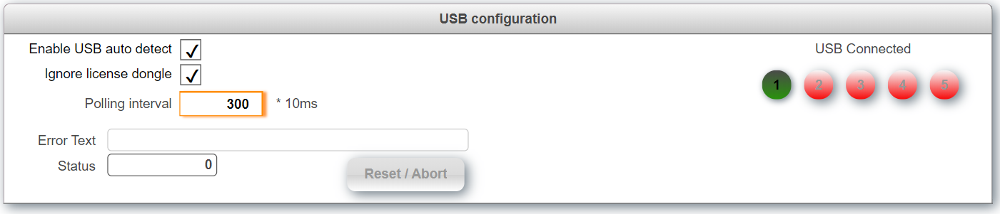

## Table of Contents
* [Introduction](#Introduction)
* [Requirements](#Requirements)
* [Description](#Description)
* [Revision History](#Revision-History)

## Introduction
This is a sample project for automatically mounting multiple USB sticks on a B&R PLC. The task creates a file device with the name "USB_DEVICE1", "USB_DEVICE2", "USB_DEVICE3", ... This device name can the be used with all libraries that support files devices, e.x. FileIO.

Download the latest release from [**here.**](https://github.com/br-automation-com/AS-USB/releases/latest) 

The task uses a variable structure to communicate with the outside world that can also be used to interact with other tasks. The structure *USB* looks as follows:

<table>
  <tr>
    <td width=100>Level 1</td>
    <td>Level 2</td>
    <td>Level Description</td>
  </tr>
  <tr style="font-weight:bold">
    <th>CMD</th>
    <td colspan="3">Used to trigger commands.</td>
  </tr>
  <tr>
   <td></td>
   <td>auto_scan</td>
   <td colspan="3">Automatically scan for USB sticks when enabled.</td>
  </tr>
  <tr>
   <td></td>
   <td>error_reset</td>
   <td colspan="3">Reset pending erros</td>
  </tr>
    <th> PAR </th>
    <td colspan="3">Parameters tructure</td>
  </tr>
  <tr>
   <td></td>
   <td>ignore_dongle</td>
   <td colspan="3">Ignore B&R license dongle</td>
  </tr>
  <tr>
   <td></td>
   <td>refresh_interval</td>
   <td colspan="3">Check for USB stick every 3s (value 300)</td>
  </tr>
  <tr>
   <td></td>
   <td>is_connected</td>
   <td colspan="3">Shows if a USB stick was detected.</td>
  </tr>
  <tr>
    <th> ERR </th>
    <td colspan="3">Information about errors</td>
  </tr>
  <tr>
   <td></td>
   <td>state</td>
   <td colspan="3">State where the error occurred</td>
  </tr>
  <tr>
   <td></td>
   <td>text</td>
   <td colspan="3">Error text</td>
  </tr>
  <tr>
   <td>status</td>
   <td colspan="3">Curent status</td>
  </tr>
</table>

## Requirements
* Automation Studio 4.5
* Automation Runtime D4.52

Recommended task class is #8 with a 10ms cycle time.

## Revision History

#### Version 0.4
- Remove state variable from PAR structure
- Added status variable to main structure
- Fixed USB reconnect issue

#### Version 0.3
- Fixed USB reconnect issue

#### Version 0.2
- Support for multiple USB sticks

#### Version 0.1
- Initial commit
